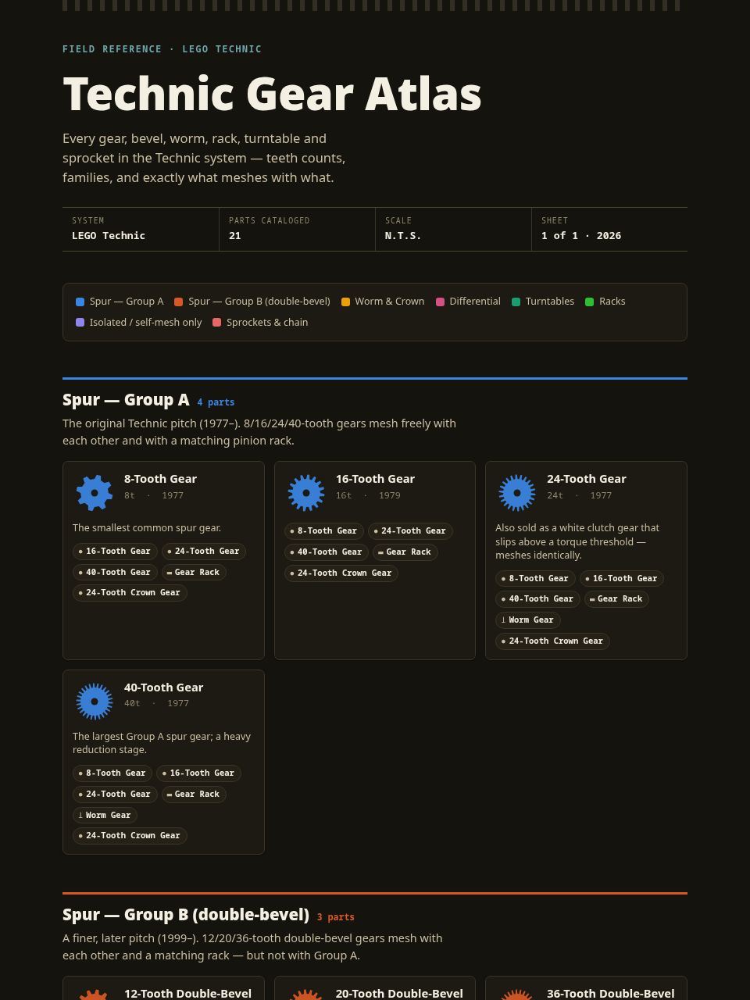

# ⚙️ Technic Gear Atlas

A tall field-reference chart of every gear, bevel, worm, rack, turntable, and sprocket in the LEGO Technic system — teeth counts, meshing families, and exactly what fits what.

**[▶ Open the interactive Atlas](https://claude.ai/code/artifact/23371080-1aef-46d4-8a0a-3d3318372e4b)** — live version with per-part icons and a hover-able compatibility matrix.

---

## In this repo

| File | What it is |
|---|---|
| [`technic-gear-atlas.html`](technic-gear-atlas.html) | The infographic itself. Self-contained — download and open in any browser. |
| [`technic-gear-atlas.pdf`](technic-gear-atlas.pdf) | Print-ready export of the same chart. |
| [`GEARS.md`](GEARS.md) | The full catalog and compatibility matrix as plain Markdown tables. |
| [`scripts/gen_notes.py`](scripts/gen_notes.py) | Source of truth for `GEARS.md` — the part list, meshing rules, and caveats as data. |

## The system, in short

21 parts sort into 8 families that only mesh within themselves (plus a few documented bridges):

| Family | Parts | Meshes with |
|---|---|---|
| **Spur — Group A** | 8t · 16t · 24t · 40t | each other, a Group A rack |
| **Spur — Group B** (double-bevel) | 12t · 20t · 36t | each other, a Group B rack — **not** Group A |
| **Worm & Crown** | worm screw · 24t crown | Group A gears; the crown also bridges to bevels |
| **Differential** | ~28t housing | a 12t or 14t bevel, at 90° |
| **Turntables** | 28t · 56t | driven at the rim (pinion pitch undocumented) |
| **Racks** | Group A pitch · Group B pitch | their matching pinion family only |
| **Isolated** | 14t bevel · 22t/14t bevel · knob wheel | only an identical copy of themselves |
| **Sprockets & chain** | 6t · 10t · 14t · 20t | nothing — chain-tread links only, no tooth mesh |

Full teeth counts, part numbers, and the complete 21×21 compatibility matrix are in **[GEARS.md](GEARS.md)**.

## Caveats

This is a fan-compiled reference (Rebrickable, BrickNerd, Technicopedia, community write-ups) — not LEGO's own documentation. Two soft spots worth knowing before you rely on it:

- **Group A ↔ Group B** can sometimes be forced to mesh with off-grid axle spacing — a community trick, not charted here.
- **Turntable rim-drive pitch** isn't consistently documented across sources, so it's left out of the matrix rather than guessed.

See [GEARS.md](GEARS.md#notes--caveats) for the full list.

---

_Compiled Aug 2026. Not affiliated with or endorsed by the LEGO Group._
